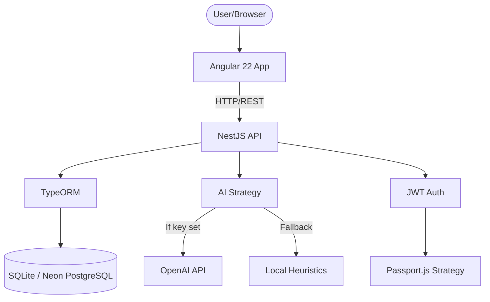

# Architecture — Study Buddy

## System Overview



## Data Flow

### Authentication Flow
```
Login/Register → JWT Token → localStorage → Bearer header on all requests
                ↓
           AuthGuard checks token → Passport validates → User entity in request
```

### Study Flow (SM-2 Spaced Repetition)
```
Dashboard → Deck Detail → Study Mode
    1. Load due cards (GET /study/:deckId/due)
    2. Show flashcard front → Click → 3D flip → Show back
    3. Rate: Fácil (5) / Media (3) / Difícil (0)
    4. POST /study/rate → SM-2 calculates next review date
    5. Next card → Repeat until all due cards reviewed
```

### AI Flashcard Generation Flow
```
User pastes text → POST /ai/generate-flashcards
  → AIStrategy.generateFlashcards(text)
    → OpenAIStrategy (if OPENAI_API_KEY set)
    → LocalFallbackStrategy (rule-based)
  → Returns {front, back}[]
  → User reviews, edits, selects
  → POST /decks/:id/flashcards/batch → Saved to DB
```

### Quiz Generation Flow
```
User selects count → GET /quiz/:deckId/generate?count=N
  → QuizService fetches flashcards from deck
  → Uses AIStrategy.generateQuizQuestions()
    → OpenAI for intelligent distractors
    → Local: uses other flashcards' answers as distractors
  → Returns QuizQuestion[] with 4 options each
  → User answers → Score tracked → Wrong answers marked for priority review
```

## Module Architecture

### Backend (NestJS)

```
src/
├── main.ts                         # Bootstrap, Swagger, CORS, ValidationPipe
├── app.module.ts                   # Root module importing all feature modules
├── common/                         # Shared (guards, decorators)
├── modules/
│   ├── auth/                       # JWT auth, register, login
│   ├── users/                      # User CRUD
│   ├── decks/                      # Deck CRUD with search
│   ├── flashcards/                 # Flashcard CRUD with batch create
│   ├── study/                      # SM-2 spaced repetition
│   ├── ai/                         # AI Strategy Pattern (OpenAI + local)
│   ├── quiz/                       # Quiz generation
│   └── dashboard/                  # Aggregated stats
└── seed/                           # Database seeding
```

### Frontend (Angular 22)

```
src/app/
├── app.ts                          # Root component with shell layout
├── app.routes.ts                   # Lazy-loaded routes with auth guard
├── app.config.ts                   # Zoneless + HttpClient providers
├── services/                       # Signal-based state management
│   ├── auth.service.ts             # Auth state (user, token, isAuthenticated)
│   ├── api.service.ts              # HTTP client wrapper
│   ├── deck-store.service.ts       # Deck state (decks, loading, stats)
│   ├── study.service.ts            # Study state (cards, flip, session)
│   ├── theme.service.ts            # Dark mode state
│   └── toast.service.ts            # Toast notifications
├── guards/
│   └── auth.guard.ts               # Route protection
├── components/                     # Reusable components
│   ├── header/                     # Nav, dark toggle, search
│   ├── toast/                      # Global notifications
│   ├── modal/                      # Generic dialog
│   ├── badge/                      # Difficulty labels
│   ├── spinner/                    # Loading indicator
│   ├── empty-state/                # Empty data placeholder
│   ├── error-state/                # Error with retry
│   ├── confirm-delete/             # Delete confirmation
│   └── icon/                       # Inline SVG icons
├── pages/                          # Lazy-loaded page components
│   ├── login/                      # Login form
│   ├── register/                   # Registration form
│   ├── dashboard/                  # Stats + deck grid
│   ├── deck-detail/                # Flashcard list + progress
│   ├── study/                      # Flashcard flip + SM-2 rating
│   ├── ai-generate/                # AI flashcard generation
│   ├── quiz/                       # Multiple choice quiz
│   └── settings/                   # Profile + theme + danger zone
└── models/
    └── interfaces.ts               # TypeScript interfaces
```

## Key Design Decisions

### Why Signal-First?
Angular 22 signals provide fine-grained reactivity without Zone.js. Every component owns its state via `signal()`, derived values via `computed()`, and external effects are explicit. This means:
- No change detection cycles to debug
- Better performance (only the DOM nodes that change re-render)
- Predictable data flow (parent→child via inputs, child→parent via outputs)

### Why Strategy Pattern for AI?
The AI Strategy Pattern allows switching between OpenAI and local fallback without changing business logic. This is critical because:
- OPENAI_API_KEY may not be available in all environments
- Local fallback provides a working baseline even without internet
- New AI providers can be added by implementing the same interface

### Why SQLite with PostgreSQL-compatible Schema?
The schema uses SQLite for development but is designed for PostgreSQL in production:
- All types are PostgreSQL-compatible (text, integer, real, date)
- Queries use standard SQL where possible
- TypeORM handles dialect differences transparently
